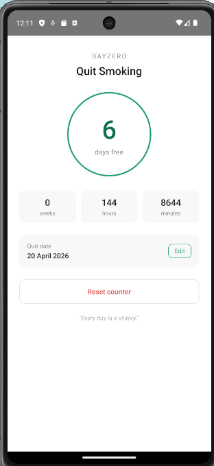

```markdown
# DayZero 🟢
A simple Android habit quit tracker built with React Native.  
Track how many days you've been free from a habit — displayed in days, weeks, hours and minutes.

---

## Screenshot



---

## What the app does
- Pick a quit date using a built-in date picker
- Automatically counts days, weeks, hours and minutes since that date
- Counter updates live every minute
- Data persists after closing the app (uses AsyncStorage)
- Reset your streak anytime with a confirmation dialog

---

## Tech Stack
| Layer | Technology |
|---|---|
| UI | React Native 0.85 |
| Language | TypeScript |
| Storage | AsyncStorage |
| Date Picker | @react-native-community/datetimepicker |
| Platform | Android |

---

## Prerequisites
Install all of these before cloning:

| Tool | Version | Download |
|---|---|---|
| Node.js | v20 or higher | https://nodejs.org |
| Java JDK | 17 | https://adoptium.net |
| Android Studio | Latest | https://developer.android.com/studio |
| VS Code | Any | https://code.visualstudio.com |

---

## Environment Setup (Windows)
These are one-time steps. Skip if already done.

### 1. Set JAVA_HOME
Add to System Environment Variables:
```
Variable: JAVA_HOME
Value: C:\Program Files\Eclipse Adoptium\jdk-17.0.18.8-hotspot
```

### 2. Set ANDROID_HOME
```
Variable: ANDROID_HOME
Value: C:\Users\YOUR_NAME\AppData\Local\Android\Sdk
```

### 3. Add to PATH
```
C:\Program Files\Eclipse Adoptium\jdk-17.0.18.8-hotspot\bin
C:\Users\YOUR_NAME\AppData\Local\Android\Sdk\platform-tools
C:\Users\YOUR_NAME\AppData\Local\Android\Sdk\emulator
```

### 4. Create local.properties
Create a file at `android/local.properties` with this content:
```
sdk.dir=C\:\\Users\\YOUR_NAME\\AppData\\Local\\Android\\Sdk
```

### 5. Add to android/gradle.properties
Add this line at the bottom:
```
org.gradle.java.home=C:\\Program Files\\Eclipse Adoptium\\jdk-17.0.18.8-hotspot
```

---

## Running the App

### Step 1 — Clone and install
```bash
git clone https://github.com/YOUR_USERNAME/DayZero.git
cd DayZero
npm install
```

### Step 2 — Start the emulator
Create a Pixel 7 emulator (API 34) in Android Studio Device Manager, then run:
```bash
emulator -avd Pixel_7 -gpu swiftshader_indirect
```
Wait until the Android home screen is fully visible and interactive.

### Step 3 — Start Metro (Terminal 1)
```bash
npx react-native start
```
Leave this terminal open the entire time.

### Step 4 — Run the app (Terminal 2)
```bash
npx react-native run-android
```
First build takes 10–20 minutes. Subsequent builds take under 2 minutes.

---

## Challenges Faced During Development

### 1. Node.js version too old
React Native 0.85 requires Node.js v20+. Running on v18 caused a `TypeError: styleText is not a function` error.  
**Fix:** Upgrade Node.js to the latest LTS from nodejs.org.

### 2. Deprecated init command
`npx react-native@latest init` is no longer supported.  
**Fix:** Use `npx @react-native-community/cli init DayZero` instead.

### 3. SDK location not found
Gradle couldn't find the Android SDK, causing build failure at line 21.  
**Fix:** Create `android/local.properties` with the correct `sdk.dir` path.

### 4. adb not recognized
Android tools were not in the system PATH.  
**Fix:** Add `platform-tools` and `emulator` folders to PATH environment variable.

### 5. Emulator won't launch — ghost process
Running `emulator -avd Pixel_7` gave "another emulator instance is running" error.  
**Fix:** Run `taskkill /F /IM emulator.exe` then retry.

### 6. Not enough disk space
Android build downloads NDK, CMake and other tools totalling 3–4 GB. Build failed mid-way.  
**Fix:** Free up at least 10 GB before building. Clear cache with:
```bash
Remove-Item -Recurse -Force "$env:USERPROFILE\.gradle\caches"
```

### 7. Java 17 not found by Gradle
Even with Java installed, Gradle couldn't find it because `JAVA_HOME` wasn't set.  
**Fix:** Set `JAVA_HOME` in environment variables AND add `org.gradle.java.home` to `gradle.properties`.

### 8. Emulator OpenGL / GPU crash
NVIDIA driver version was too old for hardware GPU acceleration.  
**Fix:** Always launch emulator with:
```bash
emulator -avd Pixel_7 -gpu swiftshader_indirect
```

### 9. AsyncStorage version mismatch
Default installed version was incompatible with React Native 0.85.  
**Fix:** Pin to a compatible version:
```bash
npm install @react-native-async-storage/async-storage@1.23.1
```

### 10. VS Code terminal not picking up environment variables
Setting variables with `setx` requires reopening the terminal. VS Code cached the old environment.  
**Fix:** Close VS Code completely and reopen, or set variables directly in `gradle.properties`.

---

## License
MIT
```
